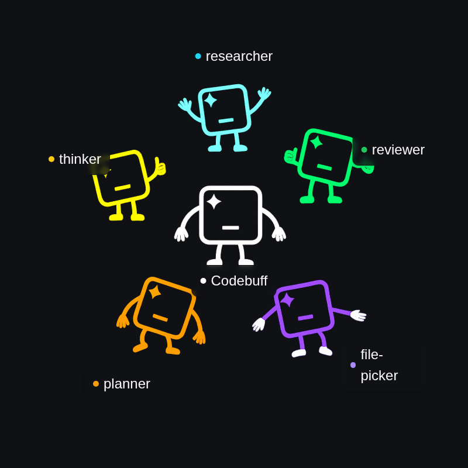

# Nexus & FreeTier

English | [简体中文](./README.zh-CN.md)

**[Nexus](https://nexus.com)** is an open-source AI coding assistant that edits your codebase through natural language instructions. **[FreeTier](https://www.npmjs.com/package/freetier)** is the free, ad-supported version — no subscription, no credits, no configuration.

Instead of using one model for everything, Nexus coordinates specialized agents that work together to understand your project and make precise changes.

<div align="center">
  
</div>

Nexus beats Claude Code at 61% vs 53% on [our evals](evals/README.md) across 175+ coding tasks over multiple open-source repos that simulate real-world tasks.


## How it works

When you ask Nexus to "add authentication to my API," it might invoke:

1. A **File Picker Agent** to scan your codebase to understand the architecture and find relevant files
2. A **Planner Agent** to plan which files need changes and in what order
3. An **Editor Agent** to make precise edits
4. A **Reviewer Agent** to validate changes

<div align="center">
  
</div>

This multi-agent approach gives you better context understanding, more accurate edits, and fewer errors compared to single-model tools.

## CLI: Install and start coding

Install:

```bash
npm install -g nexus
```

Run:

```bash
cd your-project
nexus
```

Then just tell Nexus what you want and it handles the rest:

- "Fix the SQL injection vulnerability in user registration"
- "Add rate limiting to all API endpoints"
- "Refactor the database connection code for better performance"

Nexus will find the right files, makes changes across your codebase, and runs tests to make sure nothing breaks.

## Create custom agents

To get started building your own agents, start Nexus and run the `/init` command:

```bash
nexus
```

Then inside the CLI:

```
/init
```

This creates:
```
knowledge.md               # Project context for Nexus
.agents/
└── types/                 # TypeScript type definitions
    ├── agent-definition.ts
    ├── tools.ts
    └── util-types.ts
```

You can write agent definition files that give you maximum control over agent behavior.

Implement your workflows by specifying tools, which agents can be spawned, and prompts. We even have TypeScript generators for more programmatic control.

For example, here's a `git-committer` agent that creates git commits based on the current git state. Notice that it runs `git diff` and `git log` to analyze changes, but then hands control over to the LLM to craft a meaningful commit message and perform the actual commit.

```typescript
export default {
  id: 'git-committer',
  displayName: 'Git Committer',
  model: 'openai/gpt-5-nano',
  toolNames: ['read_files', 'run_terminal_command', 'end_turn'],

  instructionsPrompt:
    'You create meaningful git commits by analyzing changes, reading relevant files for context, and crafting clear commit messages that explain the "why" behind changes.',

  async *handleSteps() {
    // Analyze what changed
    yield { tool: 'run_terminal_command', command: 'git diff' }
    yield { tool: 'run_terminal_command', command: 'git log --oneline -5' }

    // Stage files and create commit with good message
    yield 'STEP_ALL'
  },
}
```

## SDK: Run agents in production

Install the [SDK package](https://www.npmjs.com/package/@nexus/sdk) -- note this is different than the CLI nexus package.

```bash
npm install @nexus/sdk
```

Import the client and run agents!

```typescript
import { NexusClient } from '@nexus/sdk'

// 1. Initialize the client
const client = new NexusClient({
  apiKey: 'your-api-key',
  cwd: '/path/to/your/project',
  onError: (error) => console.error('Nexus error:', error.message),
})

// 2. Do a coding task...
const result = await client.run({
  agent: 'base', // Nexus's base coding agent
  prompt: 'Add error handling to all API endpoints',
  handleEvent: (event) => {
    console.log('Progress', event)
  },
})

// 3. Or, run a custom agent!
const myCustomAgent: AgentDefinition = {
  id: 'greeter',
  displayName: 'Greeter',
  model: 'openai/gpt-5.1',
  instructionsPrompt: 'Say hello!',
}
await client.run({
  agent: 'greeter',
  agentDefinitions: [myCustomAgent],
  prompt: 'My name is Bob.',
  customToolDefinitions: [], // Add custom tools too!
  handleEvent: (event) => {
    console.log('Progress', event)
  },
})
```

Learn more about the SDK [here](https://www.npmjs.com/package/@nexus/sdk).

## FreeTier: The free coding agent

Don't want a subscription? **[FreeTier](https://www.npmjs.com/package/freetier)** is a free variant of Nexus — no subscription, no credits, no configuration. Just install and start coding.

```bash
npm install -g freetier
cd your-project
freetier
```

FreeTier is ad-supported and uses models optimized for fast, high-quality assistance. It includes built-in web research, browser use, and more. Learn more in the [FreeTier README](./freetier/README.md).

## Why choose Nexus

**Custom workflows**: TypeScript generators let you mix AI generation with programmatic control. Agents can spawn subagents, branch on conditions, and run multi-step processes.

**Any model on OpenRouter**: Unlike Claude Code which locks you into Anthropic's models, Nexus supports any model available on [OpenRouter](https://openrouter.ai/models) - from Claude and GPT to specialized models like Qwen, DeepSeek, and others. Switch models for different tasks or use the latest releases without waiting for platform updates.

**Reuse any published agent**: Compose existing [published agents](https://www.nexus.com/store) to get a leg up. Nexus agents are the new MCP!

**SDK**: Build Nexus into your applications. Create custom tools, integrate with CI/CD, or embed coding assistance into your products.

## Advanced Usage

### Custom Agent Workflows

Create your own agents with specialized workflows using the `/init` command:

```bash
nexus
/init
```

This creates a custom agent structure in `.agents/` that you can customize.

## Contributing to Nexus

We ❤️ contributions from the community - whether you're fixing bugs, tweaking our agents, or improving documentation.

**Want to contribute?** Check out our [Contributing Guide](./CONTRIBUTING.md) to get started.

### Running Tests

To run the test suite:

```bash
cd cli
bun test
```

**For interactive E2E testing**, install tmux:

```bash
# macOS
brew install tmux

# Ubuntu/Debian
sudo apt-get install tmux

# Windows (via WSL)
wsl --install
sudo apt-get install tmux
```

See [cli/src/__tests__/README.md](cli/src/__tests__/README.md) for comprehensive testing documentation.

Some ways you can help:

- 🐛 **Fix bugs** or add features
- 🤖 **Create specialized agents** and publish them to the Agent Store
- 📚 **Improve documentation** or write tutorials
- 💡 **Share ideas** in our [GitHub Issues](https://github.com/NexusAI/nexus/issues)

## Get started

### Install

**CLI**: `npm install -g nexus`

**SDK**: `npm install @nexus/sdk`

**FreeTier (free)**: `npm install -g freetier`

### Resources

**Documentation**: [nexus.com/docs](https://nexus.com/docs)

**Community**: [Discord](https://nexus.com/discord)

**Issues & Ideas**: [GitHub Issues](https://github.com/NexusAI/nexus/issues)

**Contributing**: [CONTRIBUTING.md](./CONTRIBUTING.md) - Start here to contribute!

**Support**: [support@nexus.com](mailto:support@nexus.com)

## Star History

[](https://www.star-history.com/#NexusAI/nexus&Date)
